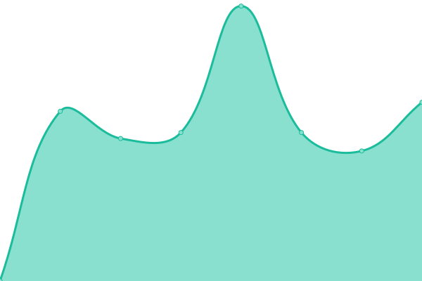
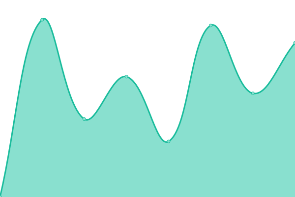
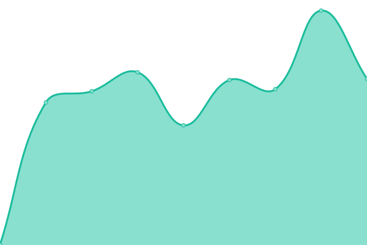
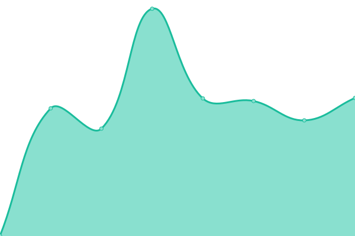
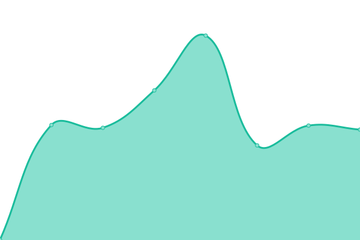

# [📈 Live Status](https://bigbang1112.github.io/gbx-tools-uptime): <!--live status--> **🟩 All systems operational**

This repository contains the open-source uptime monitor and status page for [Petr Pivoňka](bigbang1112.cz), powered by [Upptime](https://github.com/upptime/upptime).

With [Upptime](https://upptime.js.org), you can get your own unlimited and free uptime monitor and status page, powered entirely by a GitHub repository. We use [Issues](https://github.com/bigbang1112/gbx-tools-uptime/issues) as incident reports, [Actions](https://github.com/bigbang1112/gbx-tools-uptime/actions) as uptime monitors, and [Pages](https://bigbang1112.github.io/gbx-tools-uptime) for the status page.

<!--start: status pages-->
<!-- This summary is generated by Upptime (https://github.com/upptime/upptime) -->
<!-- Do not edit this manually, your changes will be overwritten -->
<!-- prettier-ignore -->
| URL | Status | History | Response Time | Uptime |
| --- | ------ | ------- | ------------- | ------ |
|  [gbx.tools](https://gbx.tools) | 🟩 Up | [gbx-tools.yml](https://github.com/BigBang1112/gbx-tools-uptime/commits/HEAD/history/gbx-tools.yml) | 

 1311ms
     
 | 

<a href="https://status.gbx.tools/history/gbx-tools">100.00%</a>
    

|  [explorer.gbx.tools](https://explorer.gbx.tools) | 🟩 Up | [explorer-gbx-tools.yml](https://github.com/BigBang1112/gbx-tools-uptime/commits/HEAD/history/explorer-gbx-tools.yml) | 

 909ms
     
 | 

<a href="https://status.gbx.tools/history/explorer-gbx-tools">99.71%</a>
    

|  [3d.gbx.tools](https://3d.gbx.tools) | 🟩 Up | [3d-gbx-tools.yml](https://github.com/BigBang1112/gbx-tools-uptime/commits/HEAD/history/3d-gbx-tools.yml) | 

 1110ms
     
 | 

<a href="https://status.gbx.tools/history/3d-gbx-tools">100.00%</a>
    

|  [io.gbx.tools](https://io.gbx.tools) | 🟩 Up | [io-gbx-tools.yml](https://github.com/BigBang1112/gbx-tools-uptime/commits/HEAD/history/io-gbx-tools.yml) | 

 868ms
     
 | 

<a href="https://status.gbx.tools/history/io-gbx-tools">100.00%</a>
    

|  [nc.gbx.tools](https://nc.gbx.tools) | 🟩 Up | [nc-gbx-tools.yml](https://github.com/BigBang1112/gbx-tools-uptime/commits/HEAD/history/nc-gbx-tools.yml) | 

 953ms
     
 | 

<a href="https://status.gbx.tools/history/nc-gbx-tools">100.00%</a>
    

|  [revalidate.gbx.tools (frontend)](https://revalidate.gbx.tools) | 🟩 Up | [revalidate-gbx-tools-frontend.yml](https://github.com/BigBang1112/gbx-tools-uptime/commits/HEAD/history/revalidate-gbx-tools-frontend.yml) | 

 934ms
     
 | 

<a href="https://status.gbx.tools/history/revalidate-gbx-tools-frontend">100.00%</a>
    

|  [revalidate.gbx.tools (API)](https://api.revalidate.gbx.tools) | 🟩 Up | [revalidate-gbx-tools-api.yml](https://github.com/BigBang1112/gbx-tools-uptime/commits/HEAD/history/revalidate-gbx-tools-api.yml) | 

 672ms
     
 | 

<a href="https://status.gbx.tools/history/revalidate-gbx-tools-api">100.00%</a>
    

|  [uotd.gbx.tools](https://uotd.gbx.tools) | 🟩 Up | [uotd-gbx-tools.yml](https://github.com/BigBang1112/gbx-tools-uptime/commits/HEAD/history/uotd-gbx-tools.yml) | 

 961ms
     
 | 

<a href="https://status.gbx.tools/history/uotd-gbx-tools">100.00%</a>
    

|  [old.explorer.gbx.tools](https://old.explorer.gbx.tools) | 🟩 Up | [old-explorer-gbx-tools.yml](https://github.com/BigBang1112/gbx-tools-uptime/commits/HEAD/history/old-explorer-gbx-tools.yml) | 

 714ms
     
 | 

<a href="https://status.gbx.tools/history/old-explorer-gbx-tools">100.00%</a>
    

|  [nuget.gbx.tools](https://nuget.gbx.tools) | 🟩 Up | [nuget-gbx-tools.yml](https://github.com/BigBang1112/gbx-tools-uptime/commits/HEAD/history/nuget-gbx-tools.yml) | 

 818ms
     
 | 

<a href="https://status.gbx.tools/history/nuget-gbx-tools">100.00%</a>
    

|  [discord.gbx.tools](https://discord.gbx.tools) | 🟩 Up | [discord-gbx-tools.yml](https://github.com/BigBang1112/gbx-tools-uptime/commits/HEAD/history/discord-gbx-tools.yml) | 

 1640ms
     
 | 

<a href="https://status.gbx.tools/history/discord-gbx-tools">100.00%</a>
    

<!--end: status pages-->

[**Visit our status website →**](https://bigbang1112.github.io/gbx-tools-uptime)

## 📄 License

- Powered by: [Upptime](https://github.com/upptime/upptime)
- Code: [MIT](./LICENSE) © [Anand Chowdhary](https://anandchowdhary.com), supported by [Pabio](https://pabio.com)
- Data in the `./history` directory: [Open Database License](https://opendatacommons.org/licenses/odbl/1-0/)
